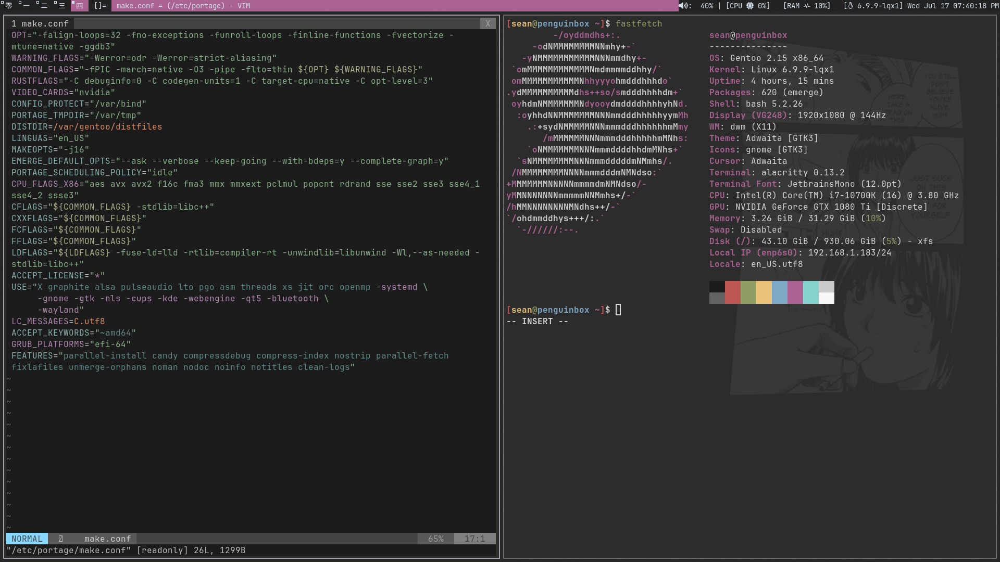

# DWM-Dotfiles
These are the DWM Dotfiles I use for Gentoo

This is MY WAY of installing and configuring dwm on my Gentoo machine. Therefore it shouldn't be seen as a guide on how your DWM should look like, but rather an inspiration for your own DWM configuration.

---
# Used Software
- [ble.sh](https://github.com/akinomyoga/ble.sh) (Bash Line Editor―a line editor written in pure Bash with syntax highlighting, auto suggestions, vim modes, etc. for Bash interactive sessions. )
- [vimrc](https://github.com/amix/vimrc) (with habamax theme)
- [alacritty](https://alacritty.org/) (GPU-accelerated terminal emulator)
- [Symbols Nerd Font](https://www.nerdfonts.com/font-downloads) (Iconic font aggregator, collection, and patcher)
- [jetbrains-mono](https://www.jetbrains.com/lp/mono/) (A free and open-source typeface for developers)
- [dunst](https://github.com/dunst-project/dunst) (Lightweight and customizable notification daemon )
- [btop](https://github.com/aristocratos/btop) (A monitor of resources )
- [PipeWire](https://www.pipewire.org/) (Multimedia processing graphs)
- [scrot](https://github.com/resurrecting-open-source-projects/scrot) (SCReenshOT - command line screen capture utility)
- [vim](https://www.vim.org/) (Vim is a highly configurable text editor)
- [fastfetch](https://github.com/fastfetch-cli/fastfetch) (An actively maintained, feature-rich and performance oriented, neofetch like system information tool. )
- [playerctl](https://github.com/altdesktop/playerctl) (🎧 mpris media player command-line controller)

### Gentoo Software
- [eix](https://wiki.gentoo.org/wiki/Eix)
- [ufed](https://wiki.gentoo.org/wiki/Ufed)
- [sys-kernel/liquorix-sources](https://gpo.zugaina.org/Overlays/thegreatmcpain) (Portage overlay)
- [media-fonts/ja-ipafonts](https://packages.gentoo.org/packages/media-fonts/ja-ipafonts) (needed in order for dwm to properly render)

# Preview

---
#### Some other projects I work on
- https://github.com/SeanIT05/Gentoo-Kernels
- https://github.com/SeanIT05/Gentoo-DELL-latitude-7390