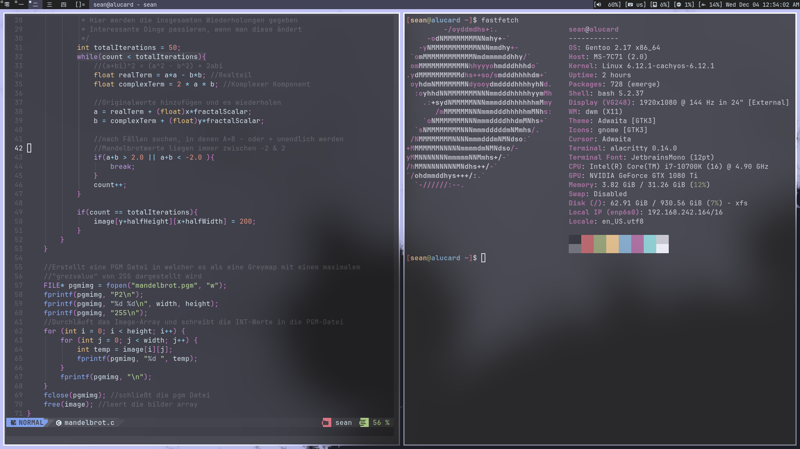

# DWM-Dotfiles
These are the DWM Dotfiles I use for Gentoo

This is MY WAY of installing and configuring dwm on my Gentoo machine. Therefore it shouldn't be seen as a guide on how your DWM should look like, but rather an inspiration for your own DWM configuration.

# Dependencies
Most of these are in the standard Arch/Gentoo repositories. If not please have a look in the [AUR](https://aur.archlinux.org/).
## See dependencies list

Read the compile error of dwm, dmenu and slstatus. It indicates missing libraries.

# Preview

#### The goal is for it to be minimal...

---

